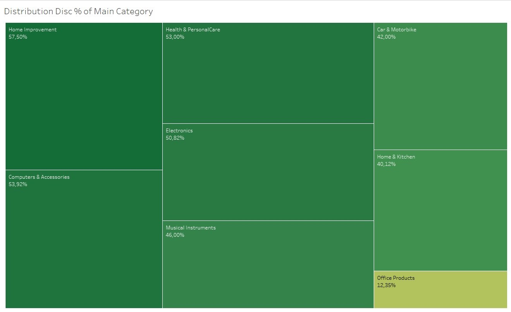

# Introduction

Hello and welcome to my data analyst project! Pacmann, one of Indonesia's premier research startups, has contributed to this initiative. In this project, we will analyze a dataset of Amazon Sales. I chose the Amazon Sales dataset because Amazon is one of the world's major e-commerce platforms. With thousands of products sold every day and customers from all over the world, I feel that examining Amazon sales data will provide deep insights into industry patterns that will assist me in identifying viable business prospects.  
This dataset may contain information regarding customer reviews and product ratings. I intend to evaluate this data to learn more about customer happiness, common challenges, and ways to improve the customer experience

Source [dataset](https://www.kaggle.com/datasets/karkavelrajaj/amazon-sales-dataset)

## Objectives
- Average Discounts: Determine and reveal the average percentage of discounts across all Amazon products.
- Rating vs. Savings Relationship: Investigate how the initial rating product relates to the discount %, demonstrating how discounts change prices.
- Analyzing the distribution of discounts across different product categories provides insight into where the best deals can be obtained.
- Find the most expensive items once discounts have been applied.
- Rating Satisfaction Overview: Gain a comprehensive picture of client satisfaction by studying average rating scores

### My project will include the following steps:
- Data collection: We'll use Kaggle to get the Amazon goods dataset.
- Data preparation entails cleaning and preprocessing the dataset in preparation for analysis.
- Exploratory Data Analyst (EDA) : We'll look at the data to see how goods are distributed by category, customer ratings, and reviews.
- Data visualization: We will use data visualization to discover trends and patterns.

By following these steps, we’ll go from collecting the data to having a clear picture of what’s happening with Amazon’s goods.

### 1. Data Collection
The dataset we’ll be utilizing contains information on over 1000 Amazon goods, such as their names, categories, prices, ratings, and reviews. We’ll be diving into this data to see what it all means and how we can utilize it to improve Amazon and its customers.
Analyzing this data can help Amazon determine which products are popular and which aren’t, and they can utilize that knowledge to better price and sell their products. Customers will be more likely to purchase a product if they find it has high ratings and a large number of positive reviews.

So we’ll be examining this dataset, performing some interesting data analysis and visualization. Let’s get started because it’s going to be awesome. I will use Microsoft Excel to process the data I downloaded from link dataset above.


#### The following are the columns of the table :
**product_id** - Product ID ; **product_name** - Name of the Product ; **category** - Category of the Product ; **discounted_price** - Discounted Price of the Product ; **actual_price** - Actual Price of the Product ; **discount_percentage** - Percentage of Discount for the Product ; **rating** - Rating of the Product ; **rating_count** - Number of people who voted for the Amazon rating ; **about_product** - Description about the Product ; **user_id** - ID of the user who wrote review for the Product ; **user_name** - Name of the user who wrote review for the Product ; **review_id** - ID of the user review ; **review_title** - Short review ; **review_content** - Long review

### 2. Data Preparation
Before we begin data analysis and visualization, we must first ensure that our dataset is clean and correctly formatted. This is known as data preparation, and it consists of multiple steps:

  2.1. Data Inspection: We’ll begin by inspecting the dataset for missing values, duplicates, or inconsistent data. We will also verify that the data types are correct and that the dataset is ready for analysis.

  2.2. Data Cleaning: After that, we’ll clean the dataset by deleting or correcting any errors, inconsistencies, or irrelevant data. This will improve the dataset’s reliability and accuracy.

  2.3. Data Transformation: Once the dataset has been cleaned, it may be necessary to alter it to make it more relevant for analysis. Scaling, normalization, and feature engineering are examples of this.

  2.4. Data Saving: After we’ve prepared the data, we’ll save it in a new file to avoid overwriting the original dataset. We may always return to the original dataset if necessary.

By following these processes, we can verify that our data is clean, correct, and ready for analysis

Let’s take action

- Check for missing values
  - Filter in column rating we will found unusual string “|”, product_id is B08L12N5H1. After we check at amazon website (https://www.amazon.in/Eureka-Forbes-Vacuum-Cleaner-Washable/dp/B08L12N5H1) the product is rated 4 so we will rate it according to what is on the website
  - Select the rating_count column, we will see there are two empty values in the column. Because missing data can influence the accuracy of our analysis, we only want to maintain rows that have all of the needed information. In this scenario, we will delete the two rows with blank ratings_count values.
- Check data type
  - Some variables in a dataset may be of the object data type, indicating that they are strings. We need to transform these variables to numeric values before we can undertake numerical analysis on them. For example, if the price variable is in object format, we cannot determine the total price of all goods. First, we must convert it to a numeric data format.
  - Remove symboll currancy in colums discounted_price and actual_price. Change the data type of column discounted_price, actual_price, rating, rating_count to number
  - Separating long sentences in the category column into several subcategories. Select the category column and then split it with the “|” delimiter. There are 7 columns formed from the separation result but we will take the first and second columns as the main category and sub category, the rest we just delete because we don’t need a very detailed category.
  - Remove any columns that aren’t required, such as product_link and img_link, review_content, review_title, review_id, user_name, user_id, about_product
  - Creating categories for rating. 
    Create a new column next to the rating column, name it rating_score that consist of :
    ```
    Score below 2.0 = Poor
    Score range of 2.0–2.9 = Below Average
    Score range of 3.0–3.9 = Average
    Score Range of 4.0–4.9 = Good
    Score of 5.0 = Excellent
    ```

  Save our work in an excel file

### 3. Exploring Data Analyst (EDA)
  3.1 Average Discount: Determines and reveals the average percentage discount across all Amazon products. And we get 47.64% on average
  
  
  

  
  3.2 Rating vs. Discount % Relationship : Investigate how product rating relates to the discount %, demonstrating how discounts change rating.
  
  
  
  We will filter by removing the 0% discount because a 0% discount is the same as no discount. As we can see in the graph, the higher the discount doesn’t mean the higher the rating. this shows that the correlation between % discount and rating is a negative correlation. On the trendline, we will see the difference after the 0% discount is removed, The R-Squared value : 0.0259947, the value is below 0.5 which means the relationship between the two variables is quite weak.
P-Value < 0.0001 means that the independent variable (disc %) has a significant effect on the rating.

  
  3.3 Analyzing the distribution of discounts across different product categories provides insight into where the best deals can be obtained

  

  The % discount distribution in the main category can be seen that Home Improvement gets the largest portion of 57.50%.

  
  3.4 The most expensive items once discounts have been applied

  

  After discounts, the most costly product is Sony Bravia 164cm (65inches) 4K Ultra HD Smart LED Google TV KD-65X74K (Black).


  3.5 Rating Satisfaction Overview: Gain a comprehensive picture of client satisfaction by studying average rating scores

  

  Rating score "Good" get a score of 75.70% on average customer satisfaction


  ### You can take a look at the [Dashboard](https://public.tableau.com/views/AmazonSales_16920104942550/AmazonSalesDashboard?%3Alanguage=en-US&publish=yes&%3Adisplay_count=n&%3Aorigin=viz_share_link) that I have made

  
